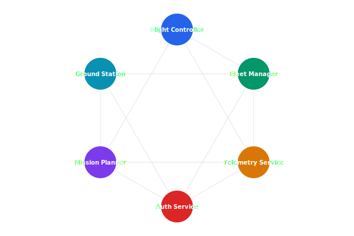

# gRPC API Reference

Internal service-to-service communication uses gRPC with Protocol Buffers. The service mesh provides load balancing, retries, and circuit breaking through Envoy sidecars.

## Overview Diagram



---

## Implementation Reference

```json
{
  "drone_id": "CX7-0042",
  "mission_id": "MSN-20260315-0819",
  "status": "inProgress",
  "telemetry": {
    "timestamp": "2026-03-15T08:23:41.003Z",
    "position": {
      "latitude": 37.41589,
      "longitude": -122.07734,
      "altitude_msl": 85.3
    },
    "velocity": {
      "ground_speed_ms": 12.4,
      "vertical_speed_ms": -0.2,
      "heading_deg": 274.1
    },
    "battery": {
      "voltage": 22.1,
      "current_a": 14.6,
      "remaining_pct": 63,
      "temperature_c": 38.2
    },
    "flight_mode": "mission",
    "satellites": 18,
    "fix_type": "rtk_fixed"
  },
  "waypoint_progress": {
    "current": 7,
    "total": 24,
    "distance_to_next_m": 142.8
  }
}
```

---

## Specification

| Service | Package | Key RPCs | Streaming |
| --- | --- | --- | --- |
| FlightControl | celestia.flight.v1 | Arm, Takeoff, Land, RTH | Telemetry (server) |
| FleetManager | celestia.fleet.v1 | Register, Deregister, Status | Events (server) |
| Telemetry | celestia.telemetry.v1 | Ingest, Query, Subscribe | Subscribe (server) |
| Auth | celestia.auth.v1 | Authenticate, Authorize, Refresh | None |
| MissionPlanner | celestia.mission.v1 | Create, Validate, Upload | Progress (server) |

### *Key Policy*

> Proto files are the single source of truth for service contracts — code must be generated, never hand-written.

## Requirements

1. All RPCs must have deadlines (max 30s for unary, 5m for streaming)
2. Proto breaking change detection must run in CI
3. Service mesh must retry idempotent RPCs up to 3 times
4. All gRPC services must implement the health checking protocol

## Action Items

- [x] Set up buf registry for proto management
- [ ] Add gRPC reflection for debugging
- [x] Document retry and timeout policies
- [ ] Implement gRPC health checking protocol
- [ ] Add client-side load balancing configuration

## Project Structure

proto/  
├── celestia/  
│   ├── flight/  
│   │   └── v1/  
│   ├── fleet/  
│   │   └── v1/  
│   ├── telemetry/  
│   │   └── v1/  
│   ├── auth/  
│   │   └── v1/  
│   └── mission/  
│       └── v1/  
├── buf.yaml  
└── buf.gen.yaml

---

## Related Documents

- [System Overview](../architecture/system-overview.md)
- [Communication Protocol](../architecture/communication-protocol.md)
- [Encryption Standards](../security/encryption.md)
