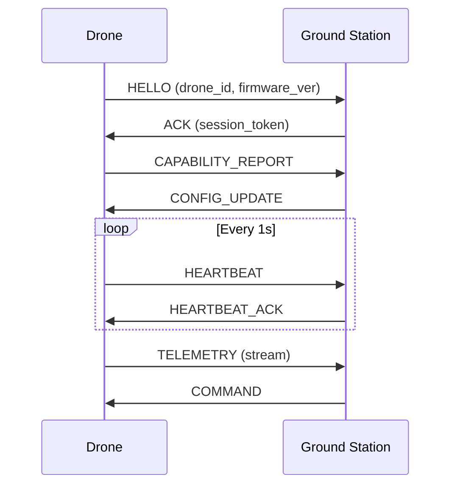

# Communication Protocol

The Celestia communication protocol governs all message exchanges between airborne drones and ground infrastructure. It implements a three-phase handshake with automatic fallback to low-bandwidth mode when signal quality degrades.

## Overview Diagram



---

## Implementation Reference

```sql
-- daily fleet utilization report: hours airborne and distance covered
-- per drone over the past 30 days

WITH flight_segments AS (
    SELECT
        drone_id,
        DATE(recorded_at)                            AS flight_date,
        EXTRACT(EPOCH FROM MAX(recorded_at) - MIN(recorded_at)) / 3600.0
                                                     AS airborne_hours,
        ST_Length(
            ST_MakeLine(position ORDER BY recorded_at)::geography
        ) / 1000.0                                   AS distance_km
    FROM telemetry.frames
    WHERE recorded_at >= CURRENT_DATE - INTERVAL '30 days'
      AND flight_mode NOT IN ('disarmed', 'idle')
    GROUP BY drone_id, DATE(recorded_at)
),
daily_summary AS (
    SELECT
        drone_id,
        flight_date,
        ROUND(SUM(airborne_hours)::numeric, 2)  AS total_hours,
        ROUND(SUM(distance_km)::numeric, 1)     AS total_km,
        COUNT(*)                                 AS segment_count
    FROM flight_segments
    GROUP BY drone_id, flight_date
)
SELECT
    d.serial_number,
    ds.flight_date,
    ds.total_hours,
    ds.total_km,
    ds.segment_count
FROM daily_summary ds
JOIN fleet.drones d ON d.drone_id = ds.drone_id
ORDER BY ds.flight_date DESC, d.serial_number;
```

---

## Specification

| Message Type | Direction | Priority | Max Size |
| --- | --- | --- | --- |
| HELLO | Drone → Ground | High | 128 bytes |
| ACK | Ground → Drone | High | 64 bytes |
| TELEMETRY | Drone → Ground | Medium | 1 KB |
| COMMAND | Ground → Drone | Critical | 256 bytes |
| HEARTBEAT | Bidirectional | High | 32 bytes |

### *Key Policy*

> Telemetry downlink must never be interrupted, even during command-link degradation.

## Requirements

1. Handshake must complete within 3 seconds
2. All messages must include monotonic sequence numbers
3. Command messages require cryptographic signature verification
4. Heartbeat loss for 10s triggers autonomous RTH
5. Protocol must degrade gracefully to 9.6 kbps links

## Action Items

- [x] Implement low-bandwidth fallback mode
- [ ] Add message compression for TELEMETRY
- [x] Validate CRC-32 on all command messages
- [ ] Benchmark throughput under 500ms latency

## Project Structure

proto/  
└── celestia/  
    ├── v1/  
    │   ├── telemetry.proto  
    │   ├── command.proto  
    │   └── handshake.proto  
    └── common/  
        └── types.proto

---

## Related Documents

- [System Overview](../architecture/system-overview.md)
- [Encryption](../security/encryption.md)
- [WebSocket API](../api/websocket-api.md)
