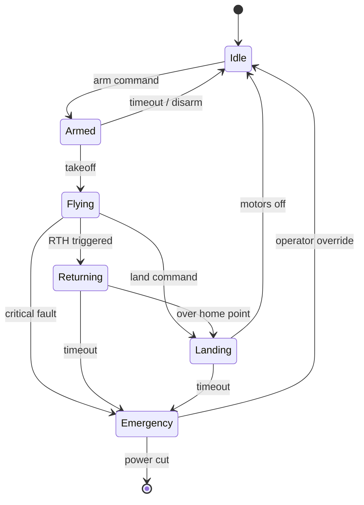

# Drone State Machine

Every drone in the Celestia fleet follows a deterministic state machine governing its lifecycle from power-on to shutdown. Transitions are triggered by a combination of operator commands and onboard sensor events.

## Overview Diagram



---

## Implementation Reference

```protobuf
syntax = "proto3";

package celestia.telemetry.v1;

option go_package = "github.com/celestia-robotics/api/telemetry/v1;telemetryv1";

message GeoPoint {
  double latitude  = 1;
  double longitude = 2;
  float  altitude_msl = 3;  // meters above sea level
}

message TelemetryFrame {
  string    drone_id      = 1;
  int64     timestamp_us  = 2;  // microseconds since epoch
  GeoPoint  position      = 3;
  float     speed_ms      = 4;
  float     heading_deg   = 5;
  float     battery_v     = 6;
  float     battery_pct   = 7;
  FlightMode flight_mode  = 8;
  IMUData   imu           = 9;
}

enum FlightMode {
  FLIGHT_MODE_UNSPECIFIED  = 0;
  FLIGHT_MODE_DISARMED     = 1;
  FLIGHT_MODE_ARMED        = 2;
  FLIGHT_MODE_TAKEOFF      = 3;
  FLIGHT_MODE_HOVER        = 4;
  FLIGHT_MODE_MISSION      = 5;
  FLIGHT_MODE_RTH          = 6;
  FLIGHT_MODE_LANDING      = 7;
  FLIGHT_MODE_EMERGENCY    = 8;
}

message IMUData {
  float accel_x = 1;
  float accel_y = 2;
  float accel_z = 3;
  float gyro_x  = 4;
  float gyro_y  = 5;
  float gyro_z  = 6;
}

message DroneCommand {
  string           drone_id   = 1;
  int64            issued_at  = 2;
  oneof command {
    GotoCommand    go_to      = 3;
    LandCommand    land       = 4;
    RTHCommand     rth        = 5;
    HoverCommand   hover      = 6;
  }
}

message GotoCommand {
  GeoPoint target   = 1;
  float    speed_ms = 2;
}

message LandCommand {}
message RTHCommand  {}
message HoverCommand { float altitude_m = 1; }
```

---

## Specification

| State | Entry Trigger | Exit Trigger | Timeout |
| --- | --- | --- | --- |
| Idle | Power on | Arm command | None |
| Armed | Pre-flight checks pass | Takeoff command | 120s → Idle |
| Flying | Altitude > 2m | Land command / RTH | None |
| Returning | RTH triggered | Altitude < 1m | 300s → Emergency |
| Landing | Descent initiated | Motors off | 60s → Emergency |
| Emergency | Critical fault | Operator override | None |

### *Key Policy*

> A drone that loses ground-station heartbeat for 10 seconds must autonomously enter Return-To-Home.

## Requirements

1. State transitions must complete within 50ms
2. All state changes must be logged to onboard flash
3. Emergency state must disable all non-essential subsystems
4. RTH must engage when battery falls below 20%

## Action Items

- [x] Implement RTH heartbeat timeout
- [x] Add GPS-denied state handling
- [ ] Test emergency landing on motor failure
- [ ] Document battery-critical transitions
- [x] Validate state persistence across reboots

---

## Related Documents

- [Flight Controller](../engineering/flight-controller.md)
- [Incident Response](../operations/incident-response.md)
- [Telemetry Pipeline](../engineering/telemetry-pipeline.md)
