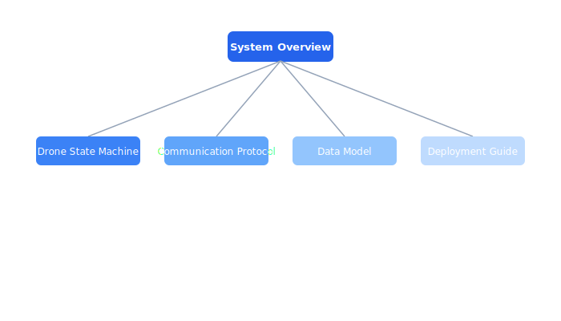

# Architecture

Core system architecture and design decisions for the Celestia drone platform.

## Contents

| Document | Description |
| --- | --- |
| [System Overview](system-overview.md) | The Celestia platform comprises six core services that coordinate autonomous dro... |
| [Drone State Machine](drone-states.md) | Every drone in the Celestia fleet follows a deterministic state machine governin... |
| [Communication Protocol](communication-protocol.md) | The Celestia communication protocol governs all message exchanges between airbor... |
| [Data Model](data-model.md) | The Celestia fleet database tracks drones, missions, waypoints, and telemetry re... |
| [Deployment Guide](deployment.md) | Celestia services are deployed as containers on a Kubernetes cluster with Helm c... |

## Section Overview

