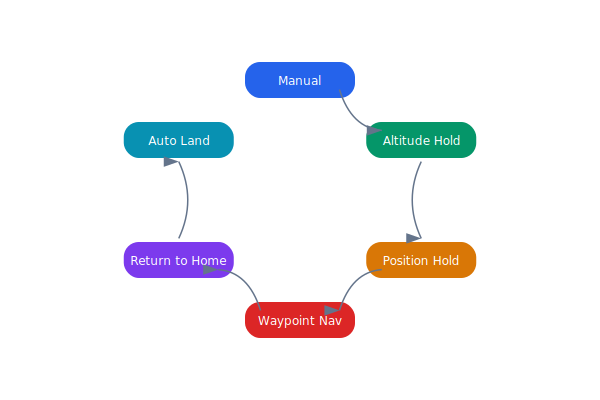

# Flight Controller

The flight controller implements a cascaded PID architecture that translates high-level navigation commands into motor thrust outputs. Multiple flight modes provide increasing levels of autonomy.

## Overview Diagram



---

## Implementation Reference

```typescript
import React, { useEffect, useState } from "react";

interface DroneStatus {
  droneId: string;
  batteryPct: number;
  flightMode: string;
  altitudeM: number;
  speedKmh: number;
  lastSeen: string;
}

interface FleetOverviewProps {
  refreshIntervalMs?: number;
}

export const FleetOverview: React.FC<FleetOverviewProps> = ({
  refreshIntervalMs = 5000,
}) => {
  const [drones, setDrones] = useState<DroneStatus[]>([]);
  const [error, setError] = useState<string | null>(null);

  useEffect(() => {
    const fetchFleet = async () => {
      try {
        const res = await fetch("/api/v1/fleet/status");
        if (!res.ok) throw new Error(`HTTP ${res.status}`);
        const data: DroneStatus[] = await res.json();
        setDrones(data.sort((a, b) => a.droneId.localeCompare(b.droneId)));
        setError(null);
      } catch (err) {
        setError(err instanceof Error ? err.message : "unknown error");
      }
    };

    fetchFleet();
    const interval = setInterval(fetchFleet, refreshIntervalMs);
    return () => clearInterval(interval);
  }, [refreshIntervalMs]);

  if (error) return <div className="fleet-error">Fleet data unavailable: {error}</div>;

  return (
    <div className="fleet-grid">
      {drones.map((d) => (
        <DroneCard key={d.droneId} drone={d} />
      ))}
    </div>
  );
};
```

---

## Specification

| Flight Mode | GPS Required | Altitude Source | Autonomy Level |
| --- | --- | --- | --- |
| Manual | No | Barometer | None |
| Altitude Hold | No | Barometer + Rangefinder | Partial |
| Position Hold | Yes | GPS + Barometer | Partial |
| Waypoint Nav | Yes | GPS + Barometer | Full |
| Return to Home | Yes | GPS + Barometer | Full |
| Auto Land | Optional | Rangefinder + Optical Flow | Full |

### *Key Policy*

> Switching from autonomous to manual mode must always be possible regardless of software state.

## Requirements

1. Control loop rate must be 400 Hz minimum
2. Attitude estimation must fuse IMU and magnetometer data
3. Geofence violations must trigger immediate RTH
4. Mode transitions must be logged with timestamp and reason

## Action Items

- [x] Tune PID gains for new 7-inch propeller
- [ ] Implement wind disturbance rejection
- [x] Add geofence enforcement in waypoint mode
- [ ] Test failsafe transitions under GPS jamming

---

## Related Documents

- [Drone States](../architecture/drone-states.md)
- [Firmware Architecture](../engineering/firmware.md)
- [Field Testing](../operations/field-testing.md)
