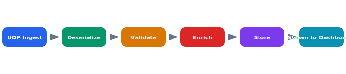

# Telemetry Pipeline

The telemetry pipeline ingests high-frequency sensor data from the drone fleet, deserializes protobuf payloads, enriches them with fleet metadata, and fans out to both persistent storage and real-time dashboard consumers.

## Overview Diagram



---

## Implementation Reference

```python
import statistics
from dataclasses import dataclass
from datetime import datetime, timezone


@dataclass
class FlightSummary:
    drone_id: str
    flight_start: datetime
    flight_end: datetime
    distance_km: float
    max_altitude_m: float
    avg_speed_kmh: float
    battery_used_pct: float


def compute_flight_summary(
    drone_id: str,
    frames: list[dict],
) -> FlightSummary:
    """Aggregate raw telemetry frames into a single flight summary."""
    if len(frames) < 2:
        raise ValueError(f"need at least 2 frames, got {len(frames)}")

    speeds = [f["speed_kmh"] for f in frames if f["speed_kmh"] is not None]
    altitudes = [f["alt_msl"] for f in frames]
    first, last = frames[0], frames[-1]

    total_distance = sum(
        haversine_km(
            frames[i]["lat"], frames[i]["lon"],
            frames[i + 1]["lat"], frames[i + 1]["lon"],
        )
        for i in range(len(frames) - 1)
    )

    return FlightSummary(
        drone_id=drone_id,
        flight_start=datetime.fromtimestamp(first["ts"], tz=timezone.utc),
        flight_end=datetime.fromtimestamp(last["ts"], tz=timezone.utc),
        distance_km=round(total_distance, 3),
        max_altitude_m=max(altitudes),
        avg_speed_kmh=round(statistics.mean(speeds), 1) if speeds else 0.0,
        battery_used_pct=round(first["battery_pct"] - last["battery_pct"], 1),
    )
```

---

## Specification

| Stage | Technology | Throughput | Latency |
| --- | --- | --- | --- |
| UDP Ingest | Rust / tokio | 50k msgs/s | <1ms |
| Deserialize | Protobuf | 50k msgs/s | <0.5ms |
| Validate | Rust | 50k msgs/s | <0.1ms |
| Enrich | Go service | 40k msgs/s | 2ms |
| Store | TimescaleDB | 10k inserts/s | 5ms |
| Stream | NATS JetStream | 40k msgs/s | 1ms |

### *Key Policy*

> Telemetry data must never be dropped under normal load — back-pressure must propagate to the ingest layer.

## Requirements

1. End-to-end latency from drone to dashboard under 100ms
2. Pipeline must auto-scale based on fleet size
3. Invalid payloads must be quarantined, not dropped silently
4. Schema evolution must be backward-compatible

## Action Items

- [x] Set up NATS JetStream cluster
- [x] Implement protobuf schema registry
- [ ] Add dead-letter queue for invalid payloads
- [ ] Benchmark pipeline under 1000-drone fleet
- [x] Document back-pressure configuration

---

## Related Documents

- [Data Model](../architecture/data-model.md)
- [Communication Protocol](../architecture/communication-protocol.md)
- [Firmware Architecture](../engineering/firmware.md)
