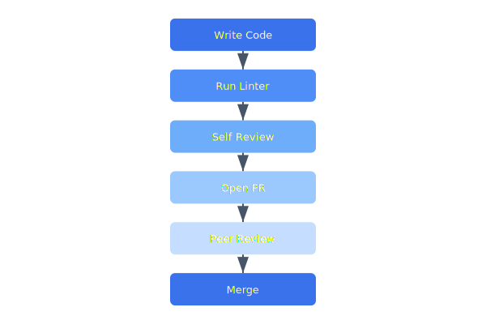

# Coding Standards

Celestia enforces consistent coding standards across all languages used in the platform. Automated linting catches style issues, while code review focuses on correctness, security, and maintainability.

## Overview Diagram



---

## Implementation Reference

```toml
[package]
name = "celestia-flight-controller"
version = "2.4.1"
edition = "2021"
authors = ["Celestia Robotics <firmware@celestia-robotics.dev>"]
description = "Flight controller firmware for the CX-7 drone platform"

[dependencies]
embedded-hal = "0.2.7"
cortex-m = "0.7.7"
cortex-m-rt = "0.7.3"
heapless = "0.8"
defmt = "0.3"
defmt-rtt = "0.4"
panic-probe = { version = "0.3", features = ["print-defmt"] }

[dependencies.stm32h7xx-hal]
version = "0.16"
features = ["stm32h743v", "rt"]

[profile.release]
opt-level = "s"
lto = true
codegen-units = 1
debug = true  # keep dwarf info for crash analysis

[profile.dev]
opt-level = 1  # minimal optimization to fit in flash during dev

[features]
default = ["imu-icm42688", "gps-ublox"]
imu-icm42688 = []
imu-bmi270 = []
gps-ublox = []
gps-trimble = []
hitl = []  # hardware-in-the-loop testing support
```

---

## Specification

| Language | Formatter | Linter | Test Framework |
| --- | --- | --- | --- |
| Go | gofmt | golangci-lint | testing + testify |
| Rust | rustfmt | clippy | cargo test |
| Python | black | ruff | pytest |
| TypeScript | prettier | eslint | vitest |
| Protobuf | buf format | buf lint | buf breaking |

### *Key Policy*

> Code review is not about gatekeeping — it is about shared understanding. Every PR is a teaching opportunity.

## Requirements

1. All PRs must pass CI before merge
2. Code coverage must not decrease on any PR
3. PRs must have at least one approving review
4. Commit messages must follow Conventional Commits format

## Action Items

- [x] Configure pre-commit hooks for all repos
- [x] Document PR review checklist
- [ ] Add CODEOWNERS file to all repositories
- [ ] Set up automated dependency update PRs

---

## Related Documents

- [Dev Setup](../onboarding/dev-setup.md)
- [Deployment Guide](../architecture/deployment.md)
- [REST API](../api/rest-api.md)
