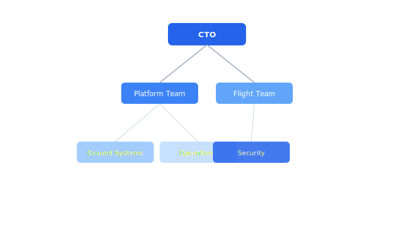

# Team Structure

The Celestia engineering organization is structured around domain teams, each owning specific services and areas of expertise. Teams operate with high autonomy but align through shared architecture reviews and cross-team guilds.

## Overview Diagram



---

## Implementation Reference

```rust
use std::time::{Duration, Instant};

#[derive(Debug, Clone, Copy, PartialEq)]
pub enum FlightState {
    Disarmed,
    PreflightCheck,
    Armed,
    Takeoff,
    Hovering,
    Mission,
    ReturnToHome,
    Landing,
    EmergencyLand,
}

pub struct SafetyMonitor {
    state: FlightState,
    last_heartbeat: Instant,
    battery_voltage: f32,
    altitude_m: f32,
    max_altitude_m: f32,
    geofence_radius_m: f32,
}

impl SafetyMonitor {
    pub fn new(max_alt: f32, geofence: f32) -> Self {
        Self {
            state: FlightState::Disarmed,
            last_heartbeat: Instant::now(),
            battery_voltage: 0.0,
            altitude_m: 0.0,
            max_altitude_m: max_alt,
            geofence_radius_m: geofence,
        }
    }

    pub fn check(&mut self, telemetry: &TelemetryFrame) -> Result<(), SafetyViolation> {
        self.battery_voltage = telemetry.battery_v;
        self.altitude_m = telemetry.alt_msl;

        if self.battery_voltage < 13.2 {
            return Err(SafetyViolation::LowBattery(self.battery_voltage));
        }
        if self.altitude_m > self.max_altitude_m {
            return Err(SafetyViolation::AltitudeBreach(self.altitude_m));
        }
        let distance = telemetry.position.distance_to(&telemetry.home);
        if distance > self.geofence_radius_m {
            return Err(SafetyViolation::GeofenceBreach(distance));
        }
        if self.last_heartbeat.elapsed() > Duration::from_secs(3) {
            return Err(SafetyViolation::HeartbeatLost);
        }

        self.last_heartbeat = Instant::now();
        Ok(())
    }

    pub fn trigger_emergency_land(&mut self) {
        log::warn!("safety: emergency landing triggered from state {:?}", self.state);
        self.state = FlightState::EmergencyLand;
    }
}
```

---

## Specification

| Team | Lead | Members | Primary Ownership |
| --- | --- | --- | --- |
| Platform | M. Chen | 4 | Infrastructure, CI/CD, Auth |
| Flight | A. Kowalski | 5 | Firmware, Flight Controller |
| Ground Systems | J. Nakamura | 4 | Ground Station, Dashboard |
| Operations | S. Preet | 3 | Manufacturing, Field Testing |
| Security | R. Volkov | 2 | Threat Model, Compliance, Crypto |

### *Key Policy*

> If you are unsure who owns a component, check the CODEOWNERS file or ask in #engineering-general.

## Requirements

1. Every service must have a designated owning team
2. On-call rotations must have at least 3 people
3. New hires must be assigned an onboarding buddy
4. Architecture decisions must be documented as ADRs

## Action Items

- [x] Update org chart with new hires
- [ ] Define cross-team guild schedule
- [x] Create onboarding buddy assignment process
- [ ] Document escalation paths per team

---

## Related Documents

- [Dev Setup](../onboarding/dev-setup.md)
- [Incident Response](../operations/incident-response.md)
- [Authentication](../security/authentication.md)
