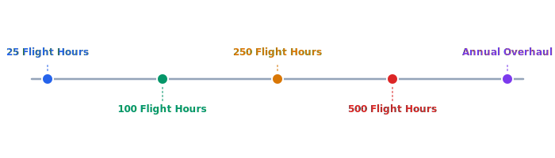

# Maintenance Schedule

Celestia drones follow a preventive maintenance schedule based on flight hours and calendar time. The schedule ensures airworthiness and extends the operational lifespan of each unit.

## Overview Diagram



---

## Implementation Reference

```dockerfile
FROM golang:1.23-alpine AS builder

RUN apk add --no-cache git ca-certificates

WORKDIR /src
COPY go.mod go.sum ./
RUN go mod download

COPY . .
RUN CGO_ENABLED=0 GOOS=linux GOARCH=amd64 go build     -ldflags="-s -w -X main.version=$(git describe --tags --always)"     -o /bin/telemetry-ingest     ./cmd/telemetry-ingest

FROM gcr.io/distroless/static-debian12:nonroot

COPY --from=builder /bin/telemetry-ingest /usr/local/bin/telemetry-ingest
COPY --from=builder /etc/ssl/certs/ca-certificates.crt /etc/ssl/certs/

EXPOSE 8080 9090

USER nonroot:nonroot
ENTRYPOINT ["telemetry-ingest"]
```

---

## Specification

| Interval | Tasks | Duration | Technician Level |
| --- | --- | --- | --- |
| 25 hours | Visual inspection, prop check, firmware update | 30 min | Level 1 |
| 100 hours | Motor test, bearing inspection, recalibration | 2 hours | Level 2 |
| 250 hours | Full sensor suite replacement, frame stress test | 4 hours | Level 2 |
| 500 hours | Motor replacement, wiring harness inspection | 6 hours | Level 3 |
| Annual | Complete overhaul, firmware re-certification | 8 hours | Level 3 |

### *Key Policy*

> A drone that has exceeded its maintenance interval must be grounded until serviced — no exceptions.

## Requirements

1. Maintenance history must be recorded per drone serial number
2. Replaced parts must be traceable to supplier lot numbers
3. Drones exceeding maintenance intervals must be auto-grounded in fleet software
4. Maintenance technicians must hold current certifications

## Action Items

- [x] Implement flight-hour tracking per drone
- [ ] Automate maintenance due alerts
- [x] Stock spare parts for 100-hour intervals
- [ ] Train two additional Level 3 technicians
- [ ] Create maintenance video guides

---

## Related Documents

- [Manufacturing](../operations/manufacturing.md)
- [Field Testing](../operations/field-testing.md)
- [Fleet Dashboard](../engineering/fleet-dashboard.md)
