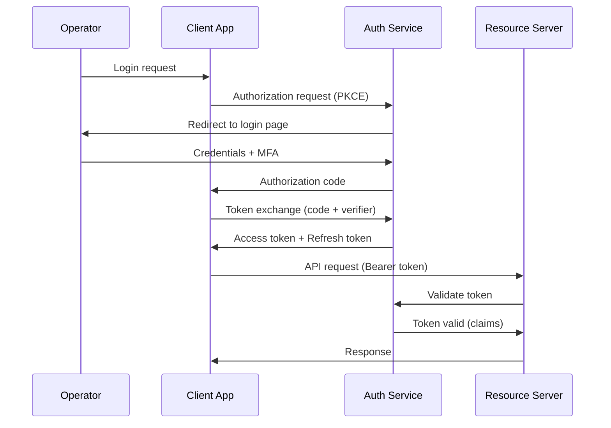

# Authentication & Authorization

The Celestia platform uses OAuth 2.0 with PKCE for operator authentication and JWT bearer tokens for service-to-service authorization. Role-based access control governs what each operator can do within the fleet management system.

## Overview Diagram



---

## Implementation Reference

```hcl
resource "aws_ecs_service" "telemetry_ingest" {
  name            = "telemetry-ingest"
  cluster         = aws_ecs_cluster.celestia.id
  task_definition = aws_ecs_task_definition.telemetry_ingest.arn
  desired_count   = 3
  launch_type     = "FARGATE"

  network_configuration {
    subnets          = var.private_subnet_ids
    security_groups  = [aws_security_group.telemetry_ingest.id]
    assign_public_ip = false
  }

  load_balancer {
    target_group_arn = aws_lb_target_group.telemetry_ingest.arn
    container_name   = "ingest"
    container_port   = 8080
  }
}

resource "aws_security_group" "telemetry_ingest" {
  name_prefix = "telemetry-ingest-"
  vpc_id      = var.vpc_id

  ingress {
    from_port       = 8080
    to_port         = 8080
    protocol        = "tcp"
    security_groups = [aws_security_group.alb.id]
  }

  egress {
    from_port   = 0
    to_port     = 0
    protocol    = "-1"
    cidr_blocks = ["0.0.0.0/0"]
  }

  tags = {
    Service     = "telemetry-ingest"
    Environment = var.environment
    ManagedBy   = "terraform"
  }
}

resource "aws_cloudwatch_log_group" "telemetry_ingest" {
  name              = "/ecs/celestia/telemetry-ingest"
  retention_in_days = 30

  tags = {
    Service = "telemetry-ingest"
  }
}
```

---

## Specification

| Role | Fleet View | Mission Control | Admin Panel | Firmware Upload |
| --- | --- | --- | --- | --- |
| Viewer | Yes | No | No | No |
| Operator | Yes | Yes | No | No |
| Lead Operator | Yes | Yes | Read-only | No |
| Engineer | Yes | Yes | No | Yes |
| Admin | Yes | Yes | Yes | Yes |

### *Key Policy*

> Service accounts must use short-lived tokens (max 15 minutes) with automatic rotation.

## Requirements

1. Passwords must meet NIST 800-63B guidelines
2. Failed login attempts must trigger lockout after 5 tries
3. All authentication events must be audit-logged
4. Token revocation must propagate within 60 seconds
5. MFA is mandatory for all admin and engineer roles

## Action Items

- [x] Implement RBAC middleware
- [x] Add MFA for admin accounts
- [ ] Integrate with corporate SAML IdP
- [ ] Add audit logging for all auth events
- [x] Document token refresh flow

---

## Related Documents

- [Threat Model](../security/threat-model.md)
- [REST API](../api/rest-api.md)
- [Team Structure](../onboarding/team-structure.md)
