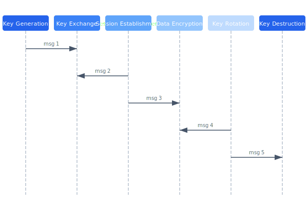

# Encryption Standards

All data in the Celestia platform is encrypted at rest and in transit. The encryption architecture uses a layered key hierarchy with hardware security modules (HSMs) protecting master keys.

## Overview Diagram



---

## Implementation Reference

```bash
#!/usr/bin/env bash
# deploy-telemetry.sh — rolling deploy of the telemetry ingest service
set -euo pipefail

SERVICE="telemetry-ingest"
CLUSTER="celestia-prod"
REGION="${AWS_REGION:-us-west-2}"
IMAGE_TAG="${1:?Usage: $0 <image-tag>}"

echo "deploying ${SERVICE} image tag: ${IMAGE_TAG}"

# validate image exists in ECR
aws ecr describe-images     --repository-name "celestia/${SERVICE}"     --image-ids "imageTag=${IMAGE_TAG}"     --region "${REGION}" > /dev/null 2>&1     || { echo "error: image tag ${IMAGE_TAG} not found in ECR"; exit 1; }

# update task definition with new image
TASK_DEF=$(aws ecs describe-task-definition     --task-definition "${SERVICE}"     --region "${REGION}"     --query 'taskDefinition'     --output json)

NEW_TASK_DEF=$(echo "${TASK_DEF}"     | jq --arg tag "${IMAGE_TAG}"         '.containerDefinitions[0].image |= sub(":[^:]+$"; ":" + $tag)')

REVISION=$(aws ecs register-task-definition     --region "${REGION}"     --cli-input-json "${NEW_TASK_DEF}"     --query 'taskDefinition.taskDefinitionArn'     --output text)

echo "registered task definition: ${REVISION}"

# rolling update
aws ecs update-service     --cluster "${CLUSTER}"     --service "${SERVICE}"     --task-definition "${REVISION}"     --region "${REGION}"     --no-cli-pager

echo "deploy initiated — waiting for stability..."
aws ecs wait services-stable     --cluster "${CLUSTER}"     --services "${SERVICE}"     --region "${REGION}"

echo "deploy complete"
```

---

## Specification

| Context | Algorithm | Key Size | Rotation Period |
| --- | --- | --- | --- |
| TLS (transit) | AES-256-GCM | 256-bit | 24 hours |
| Drone radio link | ChaCha20-Poly1305 | 256-bit | Per session |
| Database at rest | AES-256-CBC | 256-bit | 90 days |
| Firmware signing | Ed25519 | 256-bit | 1 year |
| Token signing | RS256 | 2048-bit | 30 days |

### *Key Policy*

> Master keys must never leave the HSM boundary. All cryptographic operations on master keys happen inside the HSM.

## Requirements

1. All keys must be generated using cryptographically secure RNG
2. Key material must be zeroized from memory after use
3. TLS 1.3 is the minimum acceptable version
4. Certificate pinning must be enforced for drone-to-ground links

## Action Items

- [x] Deploy HSM cluster for key management
- [ ] Implement automated key rotation
- [x] Document emergency key revocation procedure
- [ ] Evaluate post-quantum algorithms for future-proofing

## Project Structure

crypto/  
├── hsm/  
│   ├── config.yaml  
│   └── init.go  
├── tls/  
│   ├── certs/  
│   └── rotate.go  
└── radio/  
    ├── chacha.rs  
    └── handshake.rs

---

## Related Documents

- [Communication Protocol](../architecture/communication-protocol.md)
- [Authentication](../security/authentication.md)
- [Compliance](../security/compliance.md)
