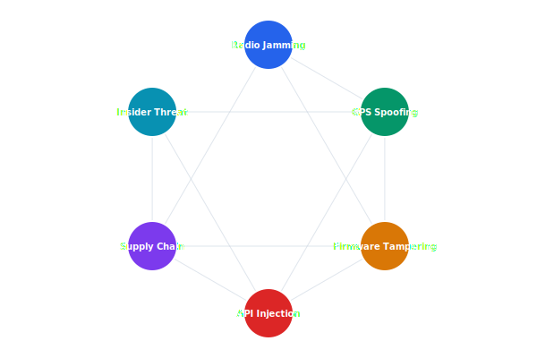

# Threat Model

The Celestia threat model identifies attack surfaces across the drone platform, from radio-frequency jamming to supply chain compromise. Each threat is rated using STRIDE methodology and mapped to specific mitigations.

## Overview Diagram



---

## Implementation Reference

```bash
#!/usr/bin/env bash
# deploy-telemetry.sh — rolling deploy of the telemetry ingest service
set -euo pipefail

SERVICE="telemetry-ingest"
CLUSTER="celestia-prod"
REGION="${AWS_REGION:-us-west-2}"
IMAGE_TAG="${1:?Usage: $0 <image-tag>}"

echo "deploying ${SERVICE} image tag: ${IMAGE_TAG}"

# validate image exists in ECR
aws ecr describe-images     --repository-name "celestia/${SERVICE}"     --image-ids "imageTag=${IMAGE_TAG}"     --region "${REGION}" > /dev/null 2>&1     || { echo "error: image tag ${IMAGE_TAG} not found in ECR"; exit 1; }

# update task definition with new image
TASK_DEF=$(aws ecs describe-task-definition     --task-definition "${SERVICE}"     --region "${REGION}"     --query 'taskDefinition'     --output json)

NEW_TASK_DEF=$(echo "${TASK_DEF}"     | jq --arg tag "${IMAGE_TAG}"         '.containerDefinitions[0].image |= sub(":[^:]+$"; ":" + $tag)')

REVISION=$(aws ecs register-task-definition     --region "${REGION}"     --cli-input-json "${NEW_TASK_DEF}"     --query 'taskDefinition.taskDefinitionArn'     --output text)

echo "registered task definition: ${REVISION}"

# rolling update
aws ecs update-service     --cluster "${CLUSTER}"     --service "${SERVICE}"     --task-definition "${REVISION}"     --region "${REGION}"     --no-cli-pager

echo "deploy initiated — waiting for stability..."
aws ecs wait services-stable     --cluster "${CLUSTER}"     --services "${SERVICE}"     --region "${REGION}"

echo "deploy complete"
```

---

## Specification

| Threat | Category (STRIDE) | Severity | Mitigation Status |
| --- | --- | --- | --- |
| Radio link jamming | Denial of Service | Critical | Mitigated (frequency hopping) |
| GPS spoofing | Tampering | High | Partial (IMU cross-check) |
| Firmware extraction | Information Disclosure | High | Mitigated (encrypted flash) |
| API token theft | Spoofing | Medium | Mitigated (short-lived JWTs) |
| Malicious mission script | Elevation of Privilege | High | Partial (sandbox) |

### *Key Policy*

> Every new feature must undergo threat modelling before entering the development backlog.

## Requirements

1. All identified threats must have documented mitigations
2. Critical threats must be re-assessed quarterly
3. Penetration testing must be performed annually
4. Threat model must be updated for every major release

## Action Items

- [x] Complete STRIDE analysis for v2 features
- [ ] Commission external penetration test
- [x] Document GPS spoofing detection algorithm
- [ ] Add runtime integrity verification for firmware
- [ ] Review third-party dependency vulnerabilities

---

## Related Documents

- [Authentication](../security/authentication.md)
- [Firmware Architecture](../engineering/firmware.md)
- [Incident Response](../operations/incident-response.md)
