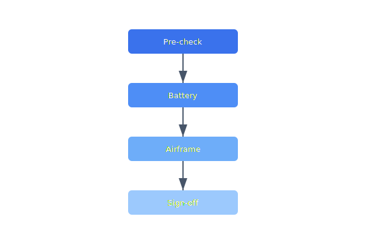

Before every Monday flight test session the test fleet must pass a standardized inspection: battery health, propeller torque, firmware version match, and radio link test. Results are logged in the compliance tracker.

## Diagram



## Implementation Reference

```bash
#!/usr/bin/env bash
# deploy-telemetry.sh — rolling deploy of the telemetry ingest service
set -euo pipefail

SERVICE="telemetry-ingest"
CLUSTER="celestia-prod"
REGION="${AWS_REGION:-us-west-2}"
IMAGE_TAG="${1:?Usage: $0 <image-tag>}"

echo "deploying ${SERVICE} image tag: ${IMAGE_TAG}"

# validate image exists in ECR
aws ecr describe-images     --repository-name "celestia/${SERVICE}"     --image-ids "imageTag=${IMAGE_TAG}"     --region "${REGION}" > /dev/null 2>&1     || { echo "error: image tag ${IMAGE_TAG} not found in ECR"; exit 1; }

# update task definition with new image
TASK_DEF=$(aws ecs describe-task-definition     --task-definition "${SERVICE}"     --region "${REGION}"     --query 'taskDefinition'     --output json)

NEW_TASK_DEF=$(echo "${TASK_DEF}"     | jq --arg tag "${IMAGE_TAG}"         '.containerDefinitions[0].image |= sub(":[^:]+$"; ":" + $tag)')

REVISION=$(aws ecs register-task-definition     --region "${REGION}"     --cli-input-json "${NEW_TASK_DEF}"     --query 'taskDefinition.taskDefinitionArn'     --output text)

echo "registered task definition: ${REVISION}"

# rolling update
aws ecs update-service     --cluster "${CLUSTER}"     --service "${SERVICE}"     --task-definition "${REVISION}"     --region "${REGION}"     --no-cli-pager

echo "deploy initiated — waiting for stability..."
aws ecs wait services-stable     --cluster "${CLUSTER}"     --services "${SERVICE}"     --region "${REGION}"

echo "deploy complete"
```

## Specification

| Check Item | Frequency | Owner | Last Completed |
| --- | --- | --- | --- |
| Propeller torque | Pre-flight | Pilot | 2026-03-28 |
| Battery health | Weekly | Ops Lead | 2026-03-24 |
| Firmware version | Pre-flight | Pilot | 2026-03-28 |
| Frame inspection | Monthly | Maintenance | 2026-03-01 |
| Radio range test | Monthly | RF Engineer | 2026-03-15 |

---

> All field operations must follow the standard operating procedure checklist. Deviations require documented justification and approval from the operations director. Equipment returned from the field must be inspected within 24 hours.

### Requirements

1. Pre-flight checklist must be completed and signed before every flight
2. Maintenance records must be linked to individual airframe serial numbers
3. Battery cycle count must be tracked and retired at 300 cycles
4. All incidents must be reported within 24 hours per company policy

### Checklist

- [x] Update pre-flight checklist for v2 hardware
- [ ] Create maintenance scheduling system
- [x] Document battery storage and disposal procedures
- [ ] Build spare parts inventory tracking
- [ ] Automate post-flight log upload and archival

### Project Structure

operations/  
├── checklists/  
│   ├── pre-flight.yaml  
│   ├── post-flight.yaml  
│   └── monthly-audit.yaml  
├── procedures/  
│   ├── battery-management.md  
│   └── incident-response.md  
└── scripts/  
    ├── fleet-health-check.sh  
    └── log-archive.sh
