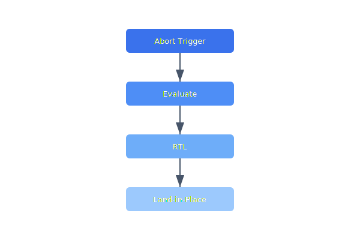

When a mission abort is triggered (geofence breach, low battery, lost link), the drone must evaluate whether return-to-launch is feasible or if an immediate controlled descent is safer. The decision tree must complete within a single control loop iteration.

## Diagram



## Implementation Reference

```lua
-- waypoint_mission.lua — survey mission for agricultural mapping
local mission = {}

local MIN_ALTITUDE = 15.0   -- meters AGL
local MAX_ALTITUDE = 120.0
local SURVEY_SPEED = 8.0    -- m/s
local PHOTO_INTERVAL = 2.0  -- seconds between captures

function mission.create_survey_grid(origin, width_m, length_m, spacing_m)
    local waypoints = {}
    local rows = math.ceil(length_m / spacing_m)

    for i = 0, rows do
        local y_offset = i * spacing_m
        local start_x, end_x

        -- serpentine pattern for efficient coverage
        if i % 2 == 0 then
            start_x, end_x = 0, width_m
        else
            start_x, end_x = width_m, 0
        end

        table.insert(waypoints, {
            lat = origin.lat + (y_offset / 111320.0),
            lon = origin.lon + (start_x / (111320.0 * math.cos(math.rad(origin.lat)))),
            alt = origin.alt,
            speed = SURVEY_SPEED,
            action = "start_capture",
        })
        table.insert(waypoints, {
            lat = origin.lat + (y_offset / 111320.0),
            lon = origin.lon + (end_x / (111320.0 * math.cos(math.rad(origin.lat)))),
            alt = origin.alt,
            speed = SURVEY_SPEED,
            action = "none",
        })
    end

    return waypoints
end

function mission.validate(waypoints)
    for idx, wp in ipairs(waypoints) do
        if wp.alt < MIN_ALTITUDE or wp.alt > MAX_ALTITUDE then
            return false, string.format("waypoint %d: altitude %.1f out of range", idx, wp.alt)
        end
    end
    return true, nil
end

return mission
```

## Specification

| Mission Type | Max Duration | Max Distance | Approval |
| --- | --- | --- | --- |
| Survey Grid | 45 min | 5 km | Auto |
| Linear Inspect | 30 min | 10 km | Pilot |
| Delivery | 20 min | 3 km | Pilot |
| Emergency SAR | 60 min | 15 km | Supervisor |
| BVLOS Test | 90 min | 20 km | Director |

---

> Every mission plan must pass automated safety validation before upload. Plans that violate airspace restrictions, exceed battery endurance estimates, or conflict with active NOTAMs are rejected at the planning stage.

### Requirements

1. Mission plans must be immutable once uploaded to the drone
2. Abort sequence must complete within 500ms of trigger
3. All missions must have a defined contingency landing site
4. Mission logs must be retained for a minimum of 5 years

### Checklist

- [x] Implement NOTAM integration for airspace checks
- [ ] Add battery endurance estimation to planner
- [x] Build mission template library for common patterns
- [ ] Create post-mission report generator
- [ ] Support contingency waypoints for weather diversion

See also [TIKI-5LXO6Q](TIKI-5LXO6Q) for related context.
