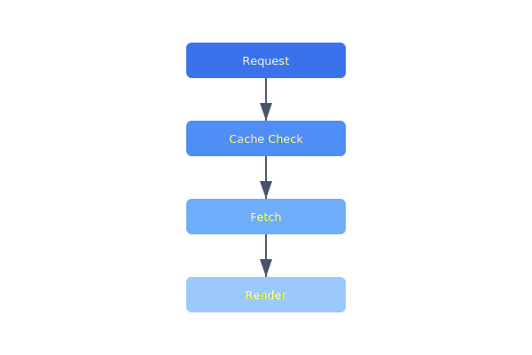

The tile cache does not respect the max-age header from the tile server, leading to outdated satellite imagery persisting for weeks. Construction sites and temporary flight restrictions are missed.

## Diagram



## Implementation Reference

```sql
-- daily fleet utilization report: hours airborne and distance covered
-- per drone over the past 30 days

WITH flight_segments AS (
    SELECT
        drone_id,
        DATE(recorded_at)                            AS flight_date,
        EXTRACT(EPOCH FROM MAX(recorded_at) - MIN(recorded_at)) / 3600.0
                                                     AS airborne_hours,
        ST_Length(
            ST_MakeLine(position ORDER BY recorded_at)::geography
        ) / 1000.0                                   AS distance_km
    FROM telemetry.frames
    WHERE recorded_at >= CURRENT_DATE - INTERVAL '30 days'
      AND flight_mode NOT IN ('disarmed', 'idle')
    GROUP BY drone_id, DATE(recorded_at)
),
daily_summary AS (
    SELECT
        drone_id,
        flight_date,
        ROUND(SUM(airborne_hours)::numeric, 2)  AS total_hours,
        ROUND(SUM(distance_km)::numeric, 1)     AS total_km,
        COUNT(*)                                 AS segment_count
    FROM flight_segments
    GROUP BY drone_id, flight_date
)
SELECT
    d.serial_number,
    ds.flight_date,
    ds.total_hours,
    ds.total_km,
    ds.segment_count
FROM daily_summary ds
JOIN fleet.drones d ON d.drone_id = ds.drone_id
ORDER BY ds.flight_date DESC, d.serial_number;
```

## Specification

| Feature | Status | Owner | Target |
| --- | --- | --- | --- |
| Live Map | In Progress | jnakamura | Q2 2026 |
| Mission Upload | Done | jnakamura | Q1 2026 |
| Log Download | Planned | spreet | Q2 2026 |
| Multi-Vehicle | Planned | jnakamura | Q3 2026 |
| Replay Viewer | Backlog | spreet | Q3 2026 |

---

> The ground station must function over satellite links with up to 2000ms round-trip latency. All commands must be idempotent, and the UI must clearly indicate stale data when connectivity degrades.

### Requirements

1. UI must render at 30fps minimum during live tracking
2. Command latency must be displayed to the operator
3. Waypoint upload must validate against active geofences
4. Session recovery must restore full state after reconnect

### Checklist

- [x] Implement WebSocket reconnect with sequence replay
- [ ] Add offline map tile caching for field ops
- [x] Build mission plan import/export as GeoJSON
- [ ] Support multi-monitor layout persistence
- [ ] Add dark mode toggle for night operations
