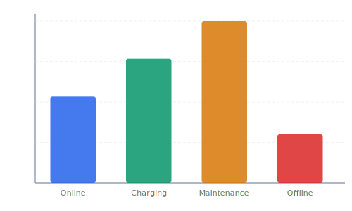

Operations needs a single-pane view showing real-time status of every drone in the fleet. The widget should aggregate heartbeat data and display battery, GPS lock, and mission state per vehicle.

## Diagram



## Implementation Reference

```typescript
import React, { useEffect, useState } from "react";

interface DroneStatus {
  droneId: string;
  batteryPct: number;
  flightMode: string;
  altitudeM: number;
  speedKmh: number;
  lastSeen: string;
}

interface FleetOverviewProps {
  refreshIntervalMs?: number;
}

export const FleetOverview: React.FC<FleetOverviewProps> = ({
  refreshIntervalMs = 5000,
}) => {
  const [drones, setDrones] = useState<DroneStatus[]>([]);
  const [error, setError] = useState<string | null>(null);

  useEffect(() => {
    const fetchFleet = async () => {
      try {
        const res = await fetch("/api/v1/fleet/status");
        if (!res.ok) throw new Error(`HTTP ${res.status}`);
        const data: DroneStatus[] = await res.json();
        setDrones(data.sort((a, b) => a.droneId.localeCompare(b.droneId)));
        setError(null);
      } catch (err) {
        setError(err instanceof Error ? err.message : "unknown error");
      }
    };

    fetchFleet();
    const interval = setInterval(fetchFleet, refreshIntervalMs);
    return () => clearInterval(interval);
  }, [refreshIntervalMs]);

  if (error) return <div className="fleet-error">Fleet data unavailable: {error}</div>;

  return (
    <div className="fleet-grid">
      {drones.map((d) => (
        <DroneCard key={d.droneId} drone={d} />
      ))}
    </div>
  );
};
```

## Specification

| Widget | Data Source | Refresh Rate | Priority |
| --- | --- | --- | --- |
| Fleet Map | Telemetry WS | 1s | P1 |
| Battery Grid | Telemetry WS | 5s | P1 |
| Mission Status | REST API | 10s | P2 |
| Weather Overlay | External API | 60s | P3 |
| Alert Feed | Event Stream | Real-time | P1 |

---

> Dashboard performance is critical for operational safety. Widgets must degrade gracefully when data sources are unavailable, showing the last known value with a staleness indicator rather than blank panels.

### Requirements

1. Initial dashboard load must complete within 2 seconds
2. WebSocket reconnect must be transparent to widgets
3. All widgets must handle missing data without crashing
4. Dashboard must support 50+ simultaneous drone tracks

### Checklist

- [x] Implement widget drag-and-drop layout editor
- [ ] Add per-operator dashboard presets
- [x] Build battery trend sparkline component
- [ ] Create configurable alert threshold panel
- [ ] Support dashboard export as PDF for reports

### Project Structure

dashboard/  
├── src/  
│   ├── widgets/  
│   │   ├── FleetMap.tsx  
│   │   ├── BatteryGrid.tsx  
│   │   └── AlertFeed.tsx  
│   └── hooks/  
│       ├── useWebSocket.ts  
│       └── useTelemetry.ts  
└── styles/  
    ├── theme.css  
    └── widgets.css

See also [TIKI-XVG0FN](TIKI-XVG0FN) for related context.
