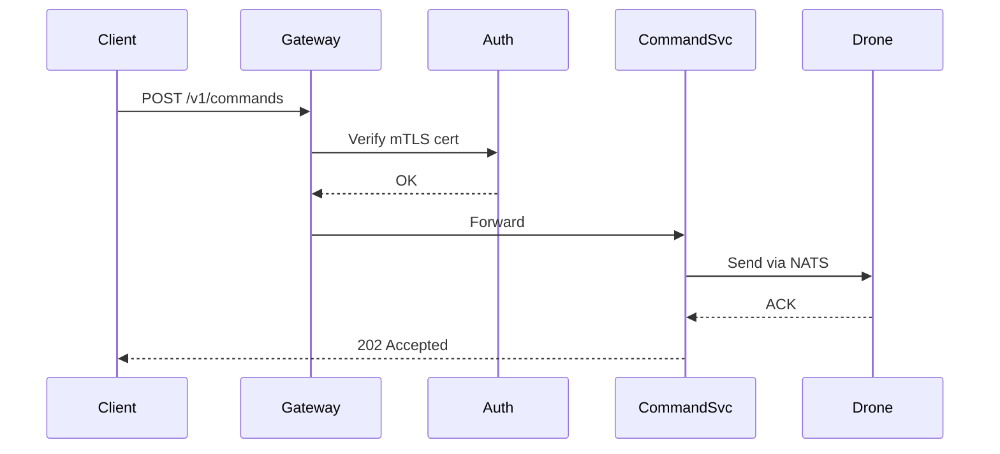

Swarm survey missions require a coordination layer that assigns survey strips, manages turn synchronization, and deconflicts altitude bands. The API should expose a mission-level abstraction over individual drone commands.

## Diagram



## Implementation Reference

```protobuf
syntax = "proto3";

package celestia.telemetry.v1;

option go_package = "github.com/celestia-robotics/api/telemetry/v1;telemetryv1";

message GeoPoint {
  double latitude  = 1;
  double longitude = 2;
  float  altitude_msl = 3;  // meters above sea level
}

message TelemetryFrame {
  string    drone_id      = 1;
  int64     timestamp_us  = 2;  // microseconds since epoch
  GeoPoint  position      = 3;
  float     speed_ms      = 4;
  float     heading_deg   = 5;
  float     battery_v     = 6;
  float     battery_pct   = 7;
  FlightMode flight_mode  = 8;
  IMUData   imu           = 9;
}

enum FlightMode {
  FLIGHT_MODE_UNSPECIFIED  = 0;
  FLIGHT_MODE_DISARMED     = 1;
  FLIGHT_MODE_ARMED        = 2;
  FLIGHT_MODE_TAKEOFF      = 3;
  FLIGHT_MODE_HOVER        = 4;
  FLIGHT_MODE_MISSION      = 5;
  FLIGHT_MODE_RTH          = 6;
  FLIGHT_MODE_LANDING      = 7;
  FLIGHT_MODE_EMERGENCY    = 8;
}

message IMUData {
  float accel_x = 1;
  float accel_y = 2;
  float accel_z = 3;
  float gyro_x  = 4;
  float gyro_y  = 5;
  float gyro_z  = 6;
}

message DroneCommand {
  string           drone_id   = 1;
  int64            issued_at  = 2;
  oneof command {
    GotoCommand    go_to      = 3;
    LandCommand    land       = 4;
    RTHCommand     rth        = 5;
    HoverCommand   hover      = 6;
  }
}

message GotoCommand {
  GeoPoint target   = 1;
  float    speed_ms = 2;
}

message LandCommand {}
message RTHCommand  {}
message HoverCommand { float altitude_m = 1; }
```

## Specification

| Endpoint | Method | Auth | Rate Limit |
| --- | --- | --- | --- |
| /v1/telemetry | POST | mTLS | 10k/min |
| /v1/missions | GET/POST | Bearer | 100/min |
| /v1/commands | POST | mTLS | 50/min |
| /v1/fleet/status | GET | Bearer | 200/min |
| /v1/alerts | GET/WS | Bearer | 500/min |

---

> All API endpoints must be documented in the OpenAPI spec before implementation. Breaking changes require a new version prefix and a minimum 90-day deprecation notice to integrators.

### Requirements

1. API response time P99 must be under 200ms
2. All endpoints must return structured error responses
3. Pagination must use cursor-based tokens, not offsets
4. WebSocket endpoints must support backpressure signaling

### Checklist

- [x] Generate Go client from OpenAPI spec
- [ ] Add request validation middleware
- [x] Implement rate limiting per API key
- [ ] Build integration test suite for v1 endpoints
- [ ] Add gRPC gateway for internal service calls

### Project Structure

api/  
├── proto/  
│   ├── telemetry.proto  
│   ├── mission.proto  
│   └── command.proto  
├── cmd/  
│   └── server/  
│       └── main.go  
└── internal/  
    └── handler/  
        ├── telemetry.go  
        └── mission.go
