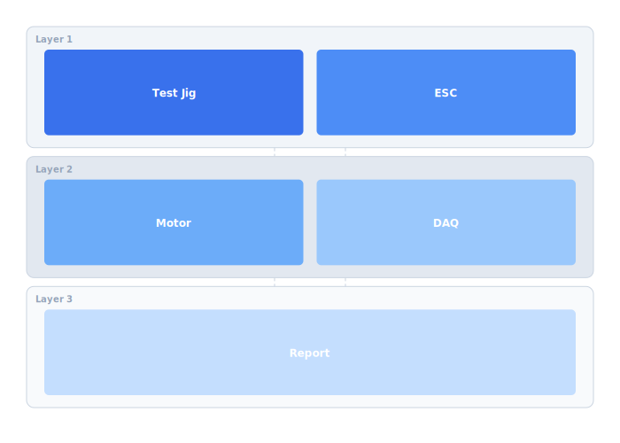

ESC calibration is done manually per motor, which takes 20 minutes per drone. An automated HIL test rig that drives each ESC through its full range and records thrust curves will cut manufacturing time and improve consistency.

## Diagram



## Implementation Reference

```yaml
apiVersion: apps/v1
kind: Deployment
metadata:
  name: telemetry-ingest
  namespace: celestia
  labels:
    app: telemetry-ingest
    team: platform
spec:
  replicas: 3
  strategy:
    type: RollingUpdate
    rollingUpdate:
      maxSurge: 1
      maxUnavailable: 0
  selector:
    matchLabels:
      app: telemetry-ingest
  template:
    metadata:
      labels:
        app: telemetry-ingest
      annotations:
        prometheus.io/scrape: "true"
        prometheus.io/port: "9090"
    spec:
      serviceAccountName: telemetry-ingest
      containers:
        - name: ingest
          image: 123456789.dkr.ecr.us-west-2.amazonaws.com/celestia/telemetry-ingest:latest
          ports:
            - containerPort: 8080
              name: http
            - containerPort: 9090
              name: metrics
          env:
            - name: DB_HOST
              valueFrom:
                secretKeyRef:
                  name: telemetry-db
                  key: host
            - name: LOG_LEVEL
              value: "info"
          resources:
            requests:
              cpu: 250m
              memory: 256Mi
            limits:
              cpu: "1"
              memory: 512Mi
          livenessProbe:
            httpGet:
              path: /healthz
              port: http
            initialDelaySeconds: 5
          readinessProbe:
            httpGet:
              path: /readyz
              port: http
```

## Specification

| Check Item | Frequency | Owner | Last Completed |
| --- | --- | --- | --- |
| Propeller torque | Pre-flight | Pilot | 2026-03-28 |
| Battery health | Weekly | Ops Lead | 2026-03-24 |
| Firmware version | Pre-flight | Pilot | 2026-03-28 |
| Frame inspection | Monthly | Maintenance | 2026-03-01 |
| Radio range test | Monthly | RF Engineer | 2026-03-15 |

---

> All field operations must follow the standard operating procedure checklist. Deviations require documented justification and approval from the operations director. Equipment returned from the field must be inspected within 24 hours.

### Requirements

1. Pre-flight checklist must be completed and signed before every flight
2. Maintenance records must be linked to individual airframe serial numbers
3. Battery cycle count must be tracked and retired at 300 cycles
4. All incidents must be reported within 24 hours per company policy

### Checklist

- [x] Update pre-flight checklist for v2 hardware
- [ ] Create maintenance scheduling system
- [x] Document battery storage and disposal procedures
- [ ] Build spare parts inventory tracking
- [ ] Automate post-flight log upload and archival

### Project Structure

operations/  
├── checklists/  
│   ├── pre-flight.yaml  
│   ├── post-flight.yaml  
│   └── monthly-audit.yaml  
├── procedures/  
│   ├── battery-management.md  
│   └── incident-response.md  
└── scripts/  
    ├── fleet-health-check.sh  
    └── log-archive.sh
