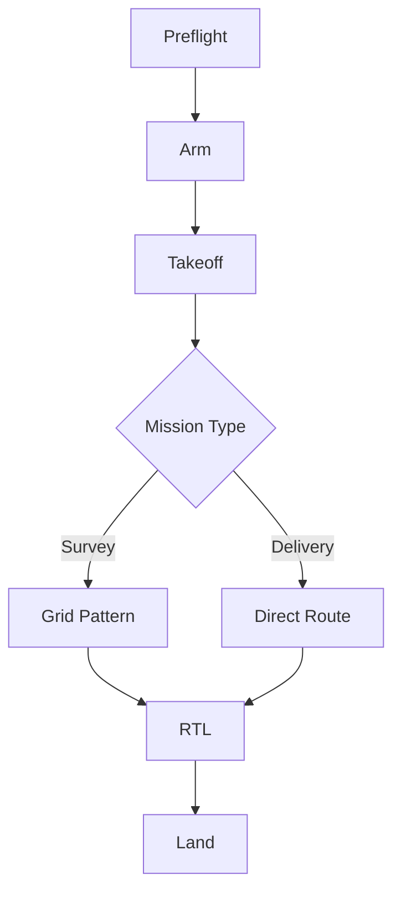

The v2 flight controller replaces the STM32F4 with an STM32H7 dual-core processor, adds redundant IMUs, and integrates an on-board ML accelerator for real-time obstacle avoidance. Target first-flight is Q3 2026.

## Diagram



## Implementation Reference

```go
package telemetry

import (
	"encoding/json"
	"log/slog"
	"net/http"
	"time"
)

type TelemetryFrame struct {
	DroneID    string    `json:"drone_id"`
	Timestamp  time.Time `json:"timestamp"`
	Latitude   float64   `json:"lat"`
	Longitude  float64   `json:"lon"`
	AltitudeMSL float64  `json:"alt_msl"`
	BatteryPct float32   `json:"battery_pct"`
	SpeedKmH   float32   `json:"speed_kmh"`
	FlightMode string    `json:"flight_mode"`
}

func (s *Server) HandleTelemetryIngest(w http.ResponseWriter, r *http.Request) {
	if r.Method != http.MethodPost {
		http.Error(w, "method not allowed", http.StatusMethodNotAllowed)
		return
	}

	var frame TelemetryFrame
	if err := json.NewDecoder(r.Body).Decode(&frame); err != nil {
		slog.Warn("telemetry: invalid payload", "error", err)
		http.Error(w, "bad request", http.StatusBadRequest)
		return
	}

	if frame.DroneID == "" {
		http.Error(w, "missing drone_id", http.StatusUnprocessableEntity)
		return
	}

	frame.Timestamp = time.Now().UTC()
	if err := s.store.InsertFrame(r.Context(), &frame); err != nil {
		slog.Error("telemetry: storage write failed", "drone", frame.DroneID, "error", err)
		http.Error(w, "internal error", http.StatusInternalServerError)
		return
	}

	s.metrics.IngestCounter.Inc()
	w.WriteHeader(http.StatusAccepted)
}
```

## Specification

| Parameter | Value | Unit | Tolerance |
| --- | --- | --- | --- |
| Max Airspeed | 22 | m/s | ±0.5 |
| Cruise Altitude | 120 | m AGL | ±2.0 |
| Max Bank Angle | 45 | deg | ±1.0 |
| Descent Rate | 3.0 | m/s | ±0.3 |
| Wind Limit | 12 | m/s | N/A |

---

> All flight controller parameter changes must be validated in SITL before uploading to a physical vehicle. Field-tuning is only permitted under direct supervision of the flight test lead.

### Requirements

1. Attitude control loop must run at 400Hz
2. Position hold accuracy within 0.5m in GPS mode
3. Motor failure detection within 50ms
4. Failsafe must trigger within 1s of lost link

### Checklist

- [x] Validate PID gains for 2.5kg payload config
- [ ] Implement wind rejection feedforward term
- [x] Add altitude hold mode for survey missions
- [ ] Test motor failure response in hexacopter config
- [ ] Calibrate compass interference map for new frame
